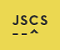

# generator-tssoft-aspnet-frontend [![NPM version][npm-image]][npm-url] [![Build Status][travis-image]][travis-url] [![Dependency Status][daviddm-image]][daviddm-url] [![Coverage percentage][coveralls-image]][coveralls-url]
> 

## Installation

First, install [Yeoman](http://yeoman.io) and generator-tssoft-aspnet-frontend using [npm](https://www.npmjs.com/) (we assume you have pre-installed [node.js](https://nodejs.org/)).

```bash
npm install -g yo
npm install -g generator-tssoft-aspnet-frontend
```

Then generate your new project:

```bash
yo generator-tssoft-aspnet-frontend
```

## Options

You can choose target framework from list:

* Angular
* React
* Backbone
* Modernizr

## Features





## License

MIT © TS Soft


[npm-image]: https://badge.fury.io/js/generator-tssoft-aspnet-frontend.svg
[npm-url]: https://npmjs.org/package/generator-tssoft-aspnet-frontend
[travis-image]: https://travis-ci.org/SLagutin/generator-tssoft-aspnet-frontend.svg?branch=master
[travis-url]: https://travis-ci.org/SLagutin/generator-tssoft-aspnet-frontend
[daviddm-image]: https://david-dm.org/SLagutin/generator-tssoft-aspnet-frontend.svg?theme=shields.io
[daviddm-url]: https://david-dm.org/SLagutin/generator-tssoft-aspnet-frontend
[coveralls-image]: https://coveralls.io/repos/SLagutin/generator-tssoft-aspnet-frontend/badge.svg
[coveralls-url]: https://coveralls.io/r/SLagutin/generator-tssoft-aspnet-frontend
